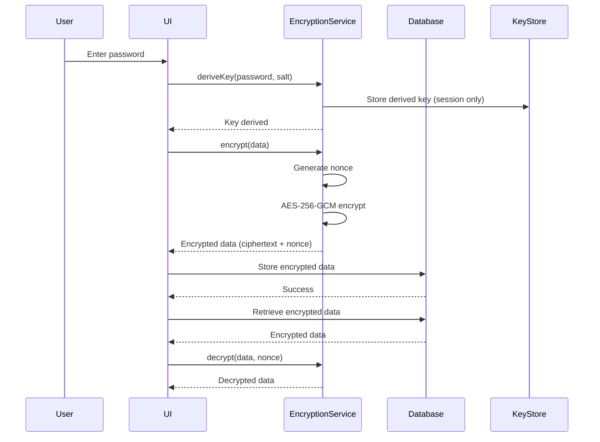

# Database Encryption Design for Aventura

## Overview
Design and implement encrypted SQLite database storage for Aventura stories, enabling secure cloud storage with AES-256-GCM encryption and Argon2id key derivation.

## Architecture

### Core Components

1. **Encryption Service** (`src/lib/services/encryption.ts`)
   - AES-256-GCM encryption/decryption
   - Argon2id key derivation from password
   - Secure random salt and nonce generation

2. **Encrypted Database Wrapper** (`src/lib/services/encryptedDatabase.ts`)
   - Wraps SQLite operations with encryption layer
   - Transparent encryption/decryption of sensitive data
   - Key caching with session-based memory management

3. **Security Settings UI** (`src/lib/components/settings/SecuritySettings.svelte`)
   - New tab in SettingsModal for security configuration
   - Database location selector
   - Password/key management interface
   - Encryption status indicator

4. **Backend Integration** (`src-tauri/src/lib.rs`)
   - Tauri commands for secure key handling
   - Database file selection via file dialog
   - Key derivation and verification

### Encryption Flow



## Technical Implementation

### 1. Dependencies

**Rust (Tauri backend):**
- `rusqlite` - SQLite bindings (already in use)
- `aes-gcm` v0.11 - AES-256-GCM encryption
- `argon2` v0.5 - Argon2id password hashing
- `rand` v0.8 - Cryptographically secure random number generation
- `secrecy` v0.8 - Secret memory handling to prevent data leaks

**TypeScript (Frontend):**
- All encryption happens in Rust backend via Tauri commands
- Frontend only handles UI and passes data to backend
- No browser-side encryption libraries needed

### 2. Database File Structure

The encrypted database file has a specific structure to enable cross-device sharing:

```
┌─────────────────────────────────────────────────────────────┐
│                    Database File Header                      │
├─────────────────────────────────────────────────────────────┤
│ Magic Number (4 bytes)     - Identifies encrypted DB        │
│ Version (2 bytes)          - Encryption format version      │
│ Salt (16 bytes)            - For Argon2id key derivation    │
├─────────────────────────────────────────────────────────────┤
│              SQLite Database (Encrypted)                     │
│                    (AES-256-GCM)                            │
├─────────────────────────────────────────────────────────────┤
│ Footer (16 bytes)          - Authentication tag (GCM)       │
└─────────────────────────────────────────────────────────────┘
```

**Why the salt is stored unencrypted:**
- The salt is not secret - it's a random value that prevents rainbow table attacks
- Storing it unencrypted allows the same password to derive the same key on any computer
- Without the salt stored, each computer would generate a different key from the same password
- The security comes from the password being secret, not the salt

**Cross-device workflow:**
1. User creates encrypted database on Computer A with password "mysecret"
2. Salt is generated (e.g., `0xA3F2...`) and stored in header
3. Key is derived: Argon2id("mysecret", salt) → 256-bit key
4. Database is encrypted and saved
5. User copies database to Computer B
6. User enters same password "mysecret"
7. System reads salt from header
8. Key is derived: Argon2id("mysecret", same salt) → same key
9. Database is successfully decrypted

**Security note:** Even though the salt is visible, an attacker cannot derive the key without the password. The salt only prevents pre-computed attacks (rainbow tables).

### 3. Key Derivation (Argon2id)

```typescript
interface KeyDerivationParams {
    memoryCost: number;      // 64 MiB minimum
    timeCost: number;        // 3 iterations minimum
    parallelism: number;     // 1 thread minimum
    saltLength: number;      // 16 bytes minimum
    outputLength: number;    // 32 bytes (256 bits for AES-256)
}

const DEFAULT_PARAMS: KeyDerivationParams = {
    memoryCost: 65536,       // 64 MiB
    timeCost: 3,             // 3 passes
    parallelism: 1,          // Single-threaded
    saltLength: 16,          // 128-bit salt
    outputLength: 32         // 256-bit key
};
```

### 4. Encryption (AES-256-GCM)

```typescript
interface EncryptedData {
    ciphertext: Uint8Array;  // Encrypted data
    nonce: Uint8Array;       // 12-byte nonce (GCM standard)
    tag: Uint8Array;         // 16-byte authentication tag
}

interface EncryptionResult {
    data: EncryptedData;
    salt: Uint8Array;        // Stored separately for key derivation
}
```

### 5. Database Location Selection

**Default Locations (OS-specific):**
| OS | Path |
|----|------|
| Linux | `~/.local/share/com.karelian.aventura/` |
| macOS | `~/Library/Application Support/` |
| Windows | `%APPDATA%\Karelian\Aventura\` |

**Custom Location via File Dialog:**
```typescript
import { open } from '@tauri-apps/plugin-dialog';

async function selectDatabasePath() {
    const path = await open({
        directory: true,
        multiple: false,
        title: 'Select Database Location',
    });
    
    if (path && typeof path === 'string') {
        databasePath = path;
        await settings.setDatabasePath(path);
    }
}
```

**Location Storage:**
- Path stored in `settings.json` (unencrypted, not sensitive)
- Only database content is encrypted, not its location
- User can move database file manually if needed

### 6. Security Settings UI

**New Tab: "Security"**

```svelte
<!-- Security Settings Tab -->
<div class="space-y-4">
    <!-- Encryption Status -->
    <div class="card bg-surface-900 p-3">
        <div class="flex items-center justify-between">
            <div>
                <h3 class="text-sm font-medium text-surface-200">Database Encryption</h3>
                <p class="text-xs text-surface-500">
                    {isEncrypted ? 'Your database is encrypted' : 'Database is not encrypted'}
                </p>
            </div>
            <span class="badge {isEncrypted ? 'bg-green-500/20 text-green-400' : 'bg-amber-500/20 text-amber-400'}">
                {isEncrypted ? 'Encrypted' : 'Unencrypted'}
            </span>
        </div>
    </div>

    <!-- Database Location -->
    <div>
        <label class="mb-2 block text-sm font-medium text-surface-300">
            Database Location
        </label>
        <div class="flex gap-2">
            <input
                type="text"
                bind:value={databasePath}
                readonly
                class="input flex-1"
            />
            <button class="btn btn-secondary" onclick={selectDatabasePath}>
                <FolderOpen class="h-4 w-4" />
                Browse
            </button>
        </div>
    </div>

    <!-- Password Input -->
    <div>
        <label class="mb-2 block text-sm font-medium text-surface-300">
            Encryption Password
        </label>
        <input
            type="password"
            bind:value={encryptionPassword}
            placeholder="Enter your encryption password"
            class="input"
        />
        <p class="mt-1 text-xs text-surface-500">
            This password is used to derive the encryption key. It is never stored.
        </p>
    </div>

    <!-- Confirm Password -->
    <div>
        <label class="mb-2 block text-sm font-medium text-surface-300">
            Confirm Password
        </label>
        <input
            type="password"
            bind:value={confirmPassword}
            placeholder="Confirm your encryption password"
            class="input"
        />
    </div>

    <!-- Actions -->
    <div class="flex gap-2">
        {#if !isEncrypted}
            <button class="btn btn-primary" onclick={enableEncryption}>
                Enable Encryption
            </button>
        {:else}
            <button class="btn btn-secondary" onclick={changePassword}>
                Change Password
            </button>
            <button class="btn btn-danger" onclick={disableEncryption}>
                Disable Encryption
            </button>
        {/if}
    </div>

    <!-- Warning -->
    <div class="border-t border-surface-700 pt-4 mt-4">
        <div class="flex items-start gap-2 text-amber-400">
            <AlertTriangle class="h-5 w-5 flex-shrink-0" />
            <p class="text-xs">
                <strong>Warning:</strong> If you lose your password, your data cannot be recovered.
                The password is not stored anywhere and is only used to derive the encryption key.
            </p>
        </div>
    </div>
</div>
```

### 6. File Structure

```
src/
├── lib/
│   ├── services/
│   │   ├── encryption.ts          # Core encryption/decryption
│   │   ├── encryptedDatabase.ts   # Database wrapper with encryption
│   │   └── database.ts            # Original database service (unchanged)
│   └── components/
│       └── settings/
│           └── SecuritySettings.svelte  # New security tab
src-tauri/
├── src/
│   └── lib.rs                     # Add Tauri commands for encryption
└── Cargo.toml                     # Add encryption dependencies
```

## Implementation Steps

### Phase 1: Core Encryption (Backend)
1. Add encryption dependencies to `Cargo.toml`
2. Implement `EncryptionService` in Rust
3. Add Tauri commands for key derivation and encryption
4. Create encrypted database wrapper

### Phase 2: Frontend Integration
1. Add encryption service TypeScript wrapper
2. Create `SecuritySettings.svelte` component
3. Integrate security tab into `SettingsModal`
4. Add database path selection dialog

### Phase 3: Migration & Testing
1. Create migration path for existing databases
2. Implement encryption/decryption of existing data
3. Add unit tests for encryption/decryption
4. Test with various password strengths
5. Verify cloud storage security

## Security Considerations

1. **Password Handling**
   - Password is never stored
   - Derived key is kept in memory only during session
   - Key is cleared from memory when app closes

2. **Salt Management**
   - Unique salt generated for each database
   - Salt stored unencrypted alongside encrypted data
   - Salt prevents rainbow table attacks

3. **Encryption Strength**
   - AES-256-GCM provides both confidentiality and integrity
   - Argon2id resistant to GPU/ASIC attacks
   - 64 MiB memory cost prevents hardware attacks

4. **Cloud Storage**
   - Encrypted database can be safely stored in cloud
   - Without password, data is cryptographically secure
   - Even if cloud provider is compromised, data remains protected

## Migration Strategy

For existing users:
1. Detect unencrypted database on startup
2. Prompt user to set encryption password
3. Encrypt existing data in background
4. Verify encryption before completing

For new users:
1. Encryption enabled by default
2. Password set during initial setup wizard
3. Database created as encrypted from start

## Testing Plan

1. **Unit Tests**
   - Key derivation with various passwords
   - Encryption/decryption round-trip
   - Authentication tag verification
   - Invalid password rejection

2. **Integration Tests**
   - Database operations with encryption
   - Performance impact measurement
   - Large data encryption

3. **Security Tests**
   - Attempt decryption with wrong password
   - Verify encrypted file is unreadable
   - Test password strength requirements
